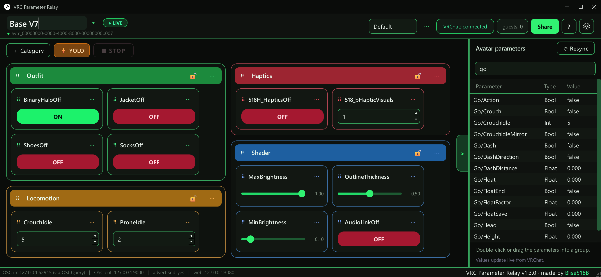

# VRC Parameter Relay

Control your VRChat avatar parameters from a desktop panel — and let friends
do it too, from any browser on phone or PC, through a share link. No port
forwarding, no accounts, no setup.

## What it does

- Shows every parameter of your current avatar live (via OSCQuery — it never
  touches port 9001, so it runs fine next to VRCFaceTracking & co.)
- Build boards from toggles, hold buttons, sliders and steppers — drag & drop
  into categories, saved per avatar, switches automatically with your avatar
- Lock a category so guests can look but not touch
- Invert a toggle (⇄) when a parameter's logic is backwards
- **Share**: one click gives you a link; anyone with it can use your board
  from any browser. Pause kicks guests but keeps the same link; Reset link
  kills all old links
- Want a link that never changes? Put a free ngrok authtoken + static domain
  into *Link settings*
- **⚡ YOLO mode**: guests get all parameters, not just your board

## Quick start

1. Download `VRCParameterRelay.exe` from
   [Releases](https://github.com/Blise518B/VRCParameterRelay/releases) —
   a single file, nothing to install
2. In VRChat: *Action Menu → Options → OSC → Enabled*
3. Start the app, open the parameter panel (green tab on the right edge),
   double-click a parameter to make a control
4. **Share → Start sharing** → send the link

First start takes a few seconds. Windows SmartScreen will complain about the
unsigned exe — *More info → Run anyway*.

## Good to know

- Settings and boards live in `%APPDATA%\VRCParameterRelay`
- The app has to run on the same PC as VRChat
- Quick-tunnel links change when you restart the app — use the ngrok option
  for a permanent one
- Windows only for now

## From source

    git clone https://github.com/Blise518B/VRCParameterRelay
    cd VRCParameterRelay
    start.bat        # sets up .venv and launches

Python 3.10+. `build.bat` builds the exe. `tools\fake_vrchat.py` +
`tools\integration_test.py` test the whole pipeline without VRChat; the other
`tools\*_test.py` scripts are safe to run while VRChat is open.

## License

[MIT](LICENSE)

Built with the help of AI.
